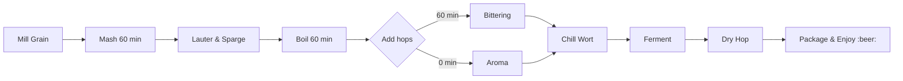

# Markdown Parity Demo

This document exercises every feature added in the markdown-parity batch.
Open it in HopsMD and use it as a manual smoke test.

---

## Syntax Highlighting

### TypeScript

```ts
function brew(hops: string[], maltBill: number): string {
  const gravity = maltBill * 0.046;
  return `${hops.join(' + ')} @ OG ${gravity.toFixed(3)}`;
}

console.log(brew(['Citra', 'Mosaic'], 12));
```

### Python

```python
def ibu(hop_oz: float, alpha: float, utilisation: float, volume_gal: float) -> float:
    """Tinseth IBU approximation."""
    return (hop_oz * alpha * utilisation * 7489) / volume_gal

print(ibu(2.0, 0.12, 0.25, 5.0))
```

### Indented Code Block (toolbar check)

The block below uses four-space indentation — the code-block toolbar should appear on hover:

    const PI = 3.14159265358979;
    const circumference = (r) => 2 * PI * r;
    console.log(circumference(5));

---

## GFM Table

| Hop Variety | Alpha Acid | Flavour Profile       | Origin  |
|-------------|------------|-----------------------|---------|
| Citra       | 11–13 %    | Citrus, tropical      | USA     |
| Mosaic      | 11.5–13 %  | Berry, earthy, citrus | USA     |
| Hallertau   | 3.5–5.5 %  | Herbal, floral        | Germany |
| Nelson Sauvin | 12–13 % | Gooseberry, grape     | NZ      |

---

## Task List

Brew-day checklist:

- [x] Sanitise all equipment
- [ ] Mill the grain
- [ ] Heat strike water to 67 °C
- [ ] Mash for 60 minutes

---

## Footnotes

Hops are the soul of any IPA[^1]. The bittering charge is added at first wort or
60-minute mark, while aroma additions go in at flame-out or during dry-hopping[^2].

[^1]: India Pale Ale — a style defined by pronounced hop character, developed in
    Britain during the colonial era and reimagined by American craft brewers in the 1980s.
[^2]: Dry-hopping is the addition of hops post-fermentation, typically at cold-crash
    temperatures, to maximise volatile aroma compounds without contributing bitterness.

---

## Math (KaTeX)

The relationship between energy and mass, inline: $E = mc^2$.

Display block — the integral of $x^2$ over $[0, 1]$:

$$
\int_0^1 x^2 \,dx = \tfrac{1}{3}
$$

And Euler's identity for good measure:

$$
e^{i\pi} + 1 = 0
$$

---

## Admonitions / Callouts

> [!NOTE]
> Mash temperature controls fermentability: lower (~63 °C) gives a drier, more
> fermentable wort; higher (~68 °C) leaves more body and residual sweetness.

> [!TIP]
> Always calibrate your hydrometer or refractometer before brew day — a small
> offset can throw your efficiency calculations off by several points.

> [!IMPORTANT]
> Pitch rate matters. Under-pitching leads to stressed yeast and off-flavours
> (fusel alcohols, acetaldehyde). Use a yeast calculator for every batch.

> [!WARNING]
> Never seal a fermenter containing actively fermenting wort without a proper
> airlock or blow-off tube. Pressure build-up can be explosive.

> [!CAUTION]
> Boiling wort is a burn hazard. Keep children and pets away from the kettle,
> and use heat-resistant gloves when handling the boil or chilling equipment.

---

## Emoji Shortcodes

Cheers to a great batch! :beer: Launch day ready :rocket: Let the celebration begin :tada:

---

## Definition List

Malt
: Germinated cereal grain (most commonly barley) that has been dried in a kiln.
  Malt provides fermentable sugars, colour, and body to the beer.

Hops
: The flower cone of *Humulus lupulus*. Added to the boil for bitterness and
  to the fermenter for aroma. Also acts as a natural preservative.

Yeast
: Unicellular fungi responsible for fermentation. They consume sugars and produce
  alcohol, CO₂, and a spectrum of flavour compounds.

Original Gravity (OG)
: A measure of the wort's sugar density before fermentation, expressed in
  specific gravity units (e.g. 1.055) or degrees Plato.

---

## Wiki-Links

For a friendly introduction to the app, see [[Willkommen]] or jump straight to
[[Willkommen|the welcome page]].

---

## Links — mailto and external

Questions? Write to us at <mailto:hello@example.com>.

More brewing science at [Brewer's Friend](https://www.brewersfriend.com).

---

## Mermaid Diagram (regression check)


