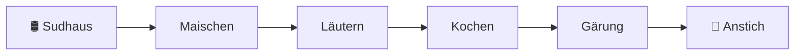
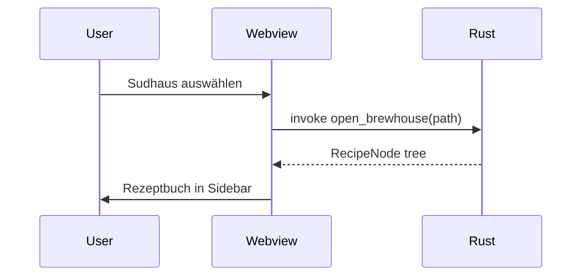

# 🍺 Willkommen in HopsMD

> _Brewing Markdown, one document at a time._

HopsMD ist ein lokaler, offline-fähiger Markdown- und Diagramm-Viewer aus der
**CloudBrew**-Familie. Diese Datei dient dir als Brauereiführung — sie zeigt
alles, was die Read-Only-Phase kann.

## Inhalt

- Standard-Markdown mit Listen, Tabellen, Zitaten
- Code-Highlighting für eingebettete Snippets
- Lokale Bilder (per Tauri Asset-Protokoll aufgelöst)
- Live gerenderte **Mermaid**-Diagramme

## Standard-Markdown

| Zutat       | Menge   | Bemerkung                 |
|-------------|---------|---------------------------|
| Pilsner Malt| 4.5 kg  | Basismalz                 |
| Hallertauer | 30 g    | 60 min Kochzeit           |
| W-34/70     | 1 Pack  | Untergärige Hefe          |

> **Tipp:** Halte deine Dokumentation kühl, aber nicht zu kalt — sonst gärt sie nicht durch.

```rust
fn main() {
    println!("Prost!");
}
```

## Mermaid live





## Fehlerfall — Trübung im Sud

Ein kaputtes Diagramm crasht **nicht** die App, sondern zeigt den Fehler
direkt im jeweiligen Container an:

```mermaid
flowchart
    A -->
```

Viel Spaß beim Brauen!
