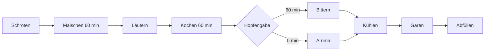
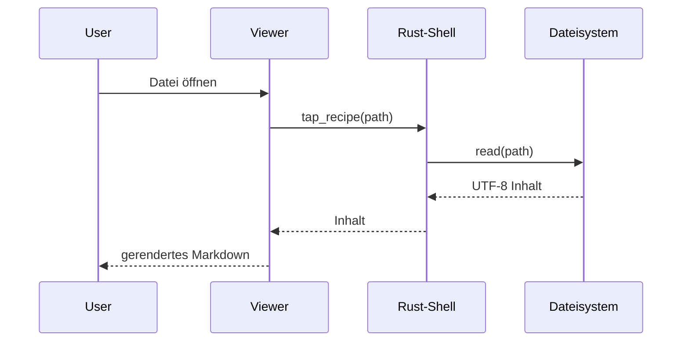
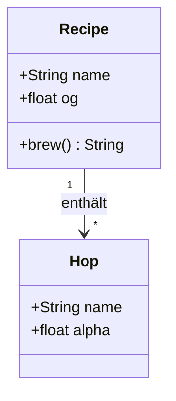
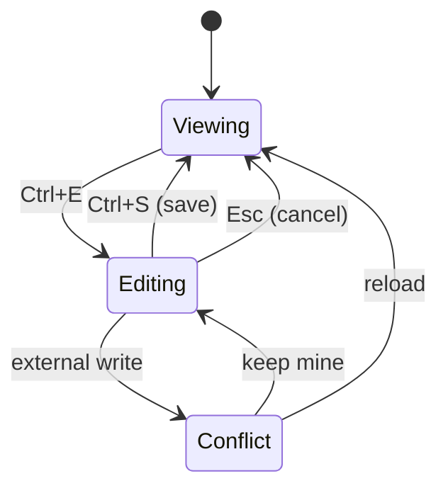
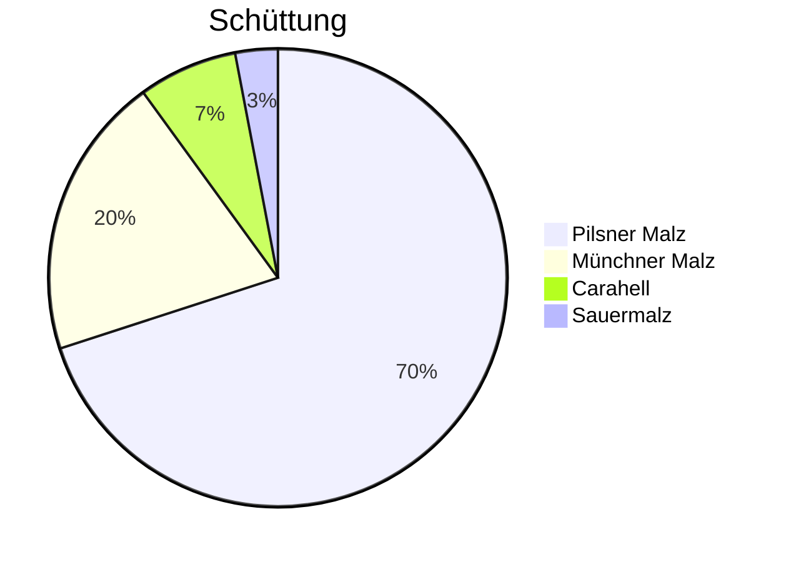
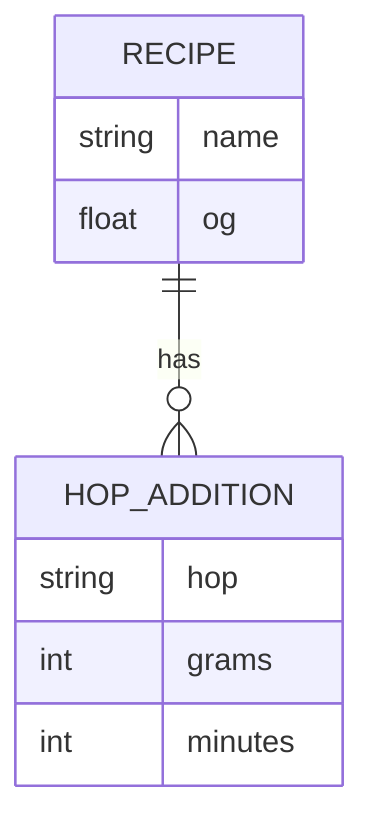

# ⑨ Mermaid-Galerie

Zurück zum [[00-START-HERE|Start]].

Jeder Mermaid-Block hat eine eigene Toolbar: **Renderer ↔ Quelltext umschalten**,
**Vollbild**, Kopieren, im Editor öffnen. Bitte beide Toggle-Zustände und Vollbild
testen. Ein kaputtes Diagramm darf die Seite **nicht** mitreißen (siehe
[[11-Edge-Cases|Grenzfälle]]).

## Flowchart

## Sequenzdiagramm

## Klassendiagramm

## Zustandsdiagramm

## Gantt

```mermaid
gantt
    title Brautag
    dateFormat HH:mm
    axisFormat %H:%M
    section Maischen
    Einmaischen      :a1, 08:00, 10m
    Rasten           :a2, after a1, 60m
    section Kochen
    Aufheizen        :b1, after a2, 20m
    Kochen           :b2, after b1, 60m
```

## Tortendiagramm

## ER-Diagramm

