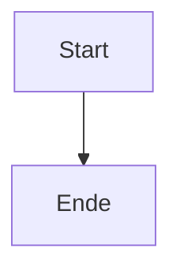

# ⑪ Grenzfälle

Zurück zum [[00-START-HERE|Start]].

Diese Seite testet Robustheit. Die YAML-**Frontmatter** oben sollte als
einklappbare Box erscheinen (`<details>summary: frontmatter</details>`).

## Kaputtes Mermaid → Fehlerisolierung

Das folgende Diagramm ist absichtlich ungültig. Es muss **lokal** als Fehler
(`<pre>` im eigenen Container) erscheinen — der Rest der Seite bleibt intakt.

```mermaid
flowchart LR
    A --> B
    B -->> C[unbalanced ((( syntax
    this is not valid mermaid at all
```

Dieser Absatz **nach** dem kaputten Diagramm muss weiterhin gerendert werden. ✅

## Zweites, gültiges Diagramm danach

Sollte normal rendern (beweist, dass ein Fehler den nächsten Block nicht killt):



## Leerer Codeblock

```

```

## Sehr langer Inline-Code

Hier ein langer Bezeichner: `dieser_sehr_lange_funktionsname_der_eventuell_umbrechen_oder_scrollen_muss_im_inline_code()`

## Tiefe Verschachtelung

> Ebene 1
> > Ebene 2
> > > Ebene 3
> > > > Ebene 4

## HTML-Injection-Versuch (muss von DOMPurify entschärft werden)

<script>alert('xss')</script>

Der obige `<script>`-Tag darf **nicht** ausgeführt werden. Ein `` ebenso:


## Sonderzeichen & Unicode

Umlaute: äöüÄÖÜß · Emoji direkt: 🍺🚀 · Akzente: café · CJK: 啤酒 · Math: ≈ ≠ ≤ ≥ ∞

## Sehr breite Tabelle (horizontales Scrollen)

| A | B | C | D | E | F | G | H | I | J |
|---|---|---|---|---|---|---|---|---|---|
| 1 | 2 | 3 | 4 | 5 | 6 | 7 | 8 | 9 | 10 |
| Citra | Mosaic | Simcoe | Amarillo | Cascade | Centennial | Chinook | Columbus | Galaxy | Nelson |
