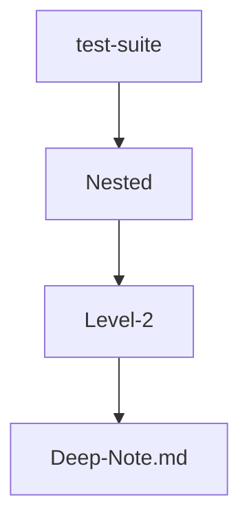

# ↳ Tiefe Notiz (Ordner-Ebene 2)

Zurück zum [[../../00-START-HERE|Start]] · hoch zum [[../Sub-Recipe|Unter-Rezept]].

Zwei Ebenen tief (`Nested/Level-2/`). Testet, dass der rekursive Scan und die
Wiki-Link-Auflösung auch über mehrere Ordnerebenen funktionieren.

> [!TIP]
> Lege hier per Rechtsklick einen **neuen Ordner** oder eine **neue Datei** an —
> der Baum sollte sofort reagieren (Watcher).

